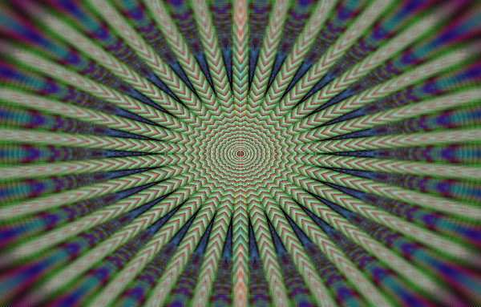

# Buffers and views {#buffers-and-views}

Buffers are contiguous blocks of memory. They are used for storing images,
audio and vertex data, or anything else you like.

You can't access a buffer's memory directly.  Instead you access a buffer
through a *view*.  Views provide a typed array-like interface to the buffer.

## Buffers

### am.buffer(size) {#am.buffer .func-def}

Returns a new buffer of the given size in bytes.

The buffer's memory will be zeroed.

The `#` operator can be used to retrieve the size of a buffer in bytes.

Fields:

- `usage`: A hint to the graphics driver telling it how this buffer will be
  used when it's used for vertex attribute data or element indices. 
  Can be one of `"static"` (the data won't change often), `"dynamic"`
  (the data will change frequenty), or `"stream"` (the data will only be
  used a few times). The default is `"static"`.

- `dataptr`: Returns a pointer to the buffer as a Lua `lightuserdata` value.
  The intended use for this is to manipulate the buffer using the
  [LuaJIT FFI library](http://luajit.org/ext_ffi.html). Readonly.

Methods:

- `mark_dirty()`: Mark the buffer dirty. This should be called if you 
  update the buffer using the `dataptr` field. This will cause
  data to be copied to any textures or vbos that depend on the buffer
  when next they are drawn. Note that you don't need to call this method if
  you're not using `dataptr` to update the buffer, for example if you're updating
  it through a view - in that case the buffer will automatically be marked
  dirty.

### am.load_buffer(filename) {#am.load_buffer .func-def}

Loads the given file and returns a buffer containing the
file's data, or `nil` if the file wasn't found.

### am.base64_encode(buffer) {#am.base64_encode .func-def}

Returns a base64 encoding of a buffer as a string.

### am.base64_decode(string) {#am.base64_decode .func-def}

Converts a base64 string to a buffer.

## Views

### buffer:view(type [, offset [, stride [, count]]]) {#buffer:view .func-def}

Returns a view into `buffer`.

`type` can be one of the following:

type                    size (bytes)  Lua value range             internal range            endianess
--------------------   -------------  --------------------------- ------------------------  -----------
`"float"`                          4  approx -3.4e38 to 3.4e38    same                      native
`"vec2"`                           8  any `vec2`                  same                      native
`"vec3"`                          12  any `vec3`                  same                      native
`"vec4"`                          16  any `vec4`                  same                      native
`"byte"`                           1  -128 to 127                 same                      N/A
`"ubyte"`                          1  0 to 255                    same                      N/A
`"byte_norm"`                      1  -1.0 to 1.0                 -127 to 127               N/A
`"ubyte_norm"`                     1  0.0 to 1.0                  0 to 255                  N/A
`"short"`                          2  -32768 to 32767             same                      native
`"ushort"`                         2  0 to 65535                  same                      native
`"short_norm"`                     2  -1.0 to 1.0                 -32767 to 32767           native
`"ushort_norm"`                    2  0.0 to 1.0                  0 to 65535                native
`"ushort_elem"`                    2  1 to 65536                  0 to 65535                native
`"int"`                            4  -2147483648 to 2147483647   same                      native
`"uint"`                           4  0 to 4294967295             same                      native
`"uint_elem"`                      4  1 to 4294967296             0 to 4294967295           native

The `_norm` types map Lua numbers in the range -1 to 1
(or 0 to 1 for unsigned types) to integer values in the buffer.

The `_elem` types are specifically for element array buffers and
offset the Lua numbers by 1 to conform to the Lua convention of 
array indices starting at 1.

All view types currently use the native platform endianess, which happens
to be little-endian on all currently supported platforms.

The `offset` argument is the byte offset of the first element of the
view. The default is 0.

The `stride` argument is the distance between consecutive values in the
view, in bytes. The default is the size of the view type.

The `count` argument determines the number of elements in the view.
The underlying buffer must be large enough to accommodate the
elements with the given stride. The default is the maximum supported by the
buffer with the given stride.

You can read and write to views as if they were Lua arrays (as with Lua
arrays, indices start at 1). For example:

~~~ {.lua}
local buf = am.buffer(12)
local view = buf:view("float")
view[1] = 1.5 
view[2] = view[1] + 2
~~~

Attempting to read an index less than 1 or larger than the number of elements
will return nil.

You can retrieve the number of elements in a view using the `#` operator.

## View fields

### view.buffer {#view.buffer .field-def}

The buffer associated with the view.

Readonly.

## View methods

### view:slice(n [, count [, stride_multiplier]]) {#view:slice .method-def}

Returns a new view with the same type as `view` that references the same buffer,
but which starts at the `n`th element of `view` and continues for
`count` elements. If `count` is omitted or nil it covers all the elements of
`view` after and including the `n`th.
`stride_multiplier` can be used to increase the stride of the view and thereby skip
elements. It must be a positive integer and defaults to 1 (no skipping).

### view:set(val [, start [, count]]) {#view:set .method-def}

Bulk sets values in a view. This is faster than setting them
one at a time.

If `val` is a number or vector then this sets all elements
of `view` to `val`.

If `val` is a table then the elements are set to their corresponding
values from the table.

As a special case, if `val` is a table of numbers and the view's type
is a vector, then the elements of the table will be used to set the
components of the vectors in the view. For example:

~~~ {.lua}
local verts = am.buffer(24):view("vec3")
verts:set{1, 2, 3, 4, 5, 6}
print(verts[1]) -- vec3(1, 2, 3)
print(verts[2]) -- vec3(4, 5, 6)
~~~

Finally if `val` is another view then the elements are set to the
corresponding values from that view. The views may be of different
types as long as they are "compatible". The types are converted
as if each element were set using the Lua code `view1[i] = view2[i]`.
This means you can't set a number view to a vector view or
vice versa.

If `start` is given then only elements at that index and beyond
will be set. The default value for `start` is `1`.

If `count` is given then at most that many elements will be set.

### am.float_array(table) {#am.float_array .func-def}

Returns a `float` view to a newly created buffer and fills
it with the values in the given table.

### am.byte_array(table) {#am.byte_array .func-def}

Returns a `byte` view to a newly created buffer and fills
it with the values in the given table.

### am.ubyte_array(table) {#am.ubyte_array .func-def}

Returns a `ubyte` view to a newly created buffer and fills
it with the values in the given table.

### am.byte_norm_array(table) {#am.byte_norm_array .func-def}

Returns a `byte_norm` view to a newly created buffer and fills
it with the values in the given table.

### am.ubyte_norm_array(table) {#am.ubyte_norm_array .func-def}

Returns a `ubyte_norm` view to a newly created buffer and fills
it with the values in the given table.

### am.short_array(table) {#am.short_array .func-def}

Returns a `short` view to a newly created buffer and fills
it with the values in the given table.

### am.ushort_array(table) {#am.ushort_array .func-def}

Returns a `ushort` view to a newly created buffer and fills
it with the values in the given table.

### am.short_norm_array(table) {#am.short_norm_array .func-def}

Returns a `short_norm` view to a newly created buffer and fills
it with the values in the given table.

### am.ushort_norm_array(table) {#am.ushort_norm_array .func-def}

Returns a `ushort_norm` view to a newly created buffer and fills
it with the values in the given table.

### am.int_array(table) {#am.int_array .func-def}

Returns an `int` view to a newly created buffer and fills
it with the values in the given table.

### am.uint_array(table) {#am.uint_array .func-def}

Returns a `uint` view to a newly created buffer and fills
it with the values in the given table.

### am.int_norm_array(table) {#am.int_norm_array .func-def}

Returns an `int_norm` view to a newly created buffer and fills
it with the values in the given table.

### am.uint_norm_array(table) {#am.uint_norm_array .func-def}

Returns a `uint_norm` view to a newly created buffer and fills
it with the values in the given table.

### am.ushort_elem_array(table) {#am.ushort_elem_array .func-def}

Returns a `ushort_elem` view to a newly created buffer and fills
it with the values in the given table.

### am.uint_elem_array(table) {#am.uint_elem_array .func-def}

Returns a `uint_elem` view to a newly created buffer and fills
it with the values in the given table.

### am.vec2_array(table) {#am.vec2_array .func-def}

Returns a `vec2` view to a newly created buffer and fills
it with the values in the given table.

The table may contain either `vec2`s or numbers (though not a mix). If the
table contains numbers they are used for the vector components and the
resulting view will have half the number of elements as there are
numbers in the table.

### am.vec3_array(table) {#am.vec3_array .func-def}

Returns a `vec3` view to a newly created buffer and fills
it with the values in the given table.

The table may contain either `vec3`s or numbers (though not a mix). If the
table contains numbers they are used for the vector components and the
resulting view will have a third the number of elements as there are
numbers in the table.

### am.vec4_array(table) {#am.vec4_array .func-def}

Returns a `vec4` view to a newly created buffer containing
the values in the given table.

The table may contain either `vec4`s or numbers (though not a mix). If the
table contains numbers they are used for the vector components and the
resulting view will have a quarter the number of elements as there are
numbers in the table.

### am.struct_array(size, spec) {#am.struct_array .func-def}

Returns a table of views of the given `size` as defined by
`spec`. `spec` is a sequence of view name (a string) and
view type (also a string) pairs.
The returned table can be passed directly
to the [`am.bind`](#am.bind) function.
The views all use the same underlying buffer.

For example:

~~~ {.lua}
local arr = am.struct_array(3, {"vert", "vec2", "color", "vec4"})
arr.vert:set{vec2(-1, 0), vec2(1, 0), vec2(0, 1)} 
arr.color:set(vec4(1, 0, 0.5, 1))
~~~

